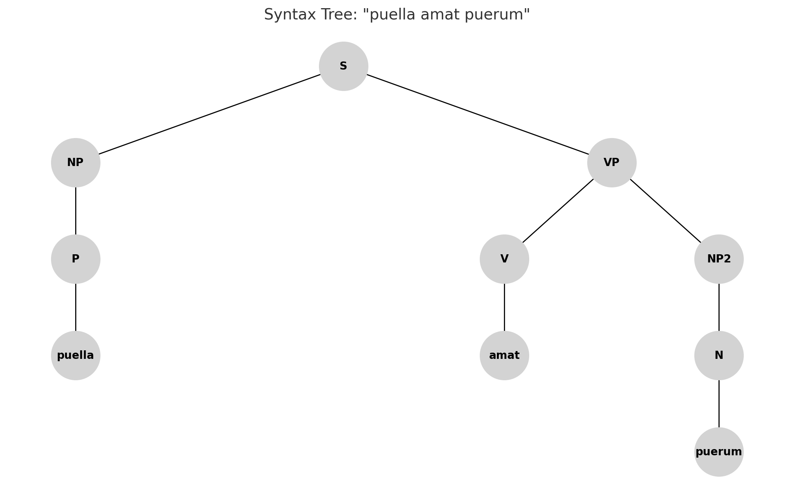
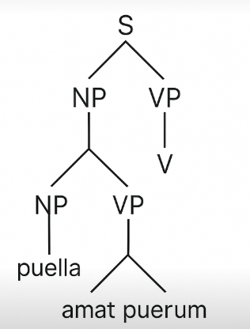
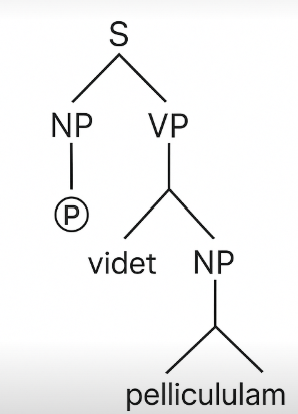

# E2-Generating-and-Cleaning-a-Restricted-Context-Free-Grammar

## Description

For this project, i have chose **Latin** as the target language for grammar generation and analysis.

Latin is a classical language belongs to the Italic branch of the Indo-European languages. It was spoken in the Roman Republic and the Roman Empire, and it remains highly influential in modern languages, law, science, and theology. Despite being considered a "dead language" meaning it no longer has native speakers, Latin is still actively seen, studied and used in academic, ecclesiastical, and legal contexts.

For the scope of this project, we will focus on modeling a **subset of Latin phrases** with a simplified structure:
- Basic noun phrases (e.g., *"Puella amat" — "The girl loves"*)
- Simple subject-verb-object constructions
- Consistent use of singular nominative and accusative cases

This restricted subset allows to define a manageable grammar that captures the essence of Latin sentence construction, while remaining simple enough for syntactic analysis, grammar transformations, and parsing tests.

My objective is to develop a formal grammar that can generate and validate simple Latin sentences based on this structure, and progressively refine it to remove ambiguity and left recursion.

## Model of the Solution

The grammar that recognizes the language is the following:

S → NP VP
NP → P | N
VP → V NP
P → ego | tu | ille | illa | nos | vos | illi
V → edit | bibit | amat | videt
N → puella | puerum | panem | aquam | pila | pelliculam

> "Noun phrases (NP) can be either nominative pronouns (P) or nouns (N) acting as subjects."

Where:

- **S** (Sentence): Represents the entire sentence.
- **NP** (Noun Phrase): Represents the subject or object and consists of a Pronoun.
- **VP** (Verb Phrase): Represents the action performed by the subject over an object and consists of a Verb followed by a Noun Phrase.
- **P** (Pronoun/Noun acting as subject): Includes simple Latin nominative forms.
- **V** (Verb): Includes basic present tense verbs.
- **N** (Noun): Represents the object, in accusative case.

This structure ensures that the grammar is **context-free** and **suitable for LL(1) parsing** after eliminating ambiguity and left recursion.

---

### Example of the syntactic tree for the sentence:

> **"puella amat puerum"**

The corresponding syntactic tree is:


 ## Examples of Parse Trees (LL(1))
Here are examples of the syntactic trees generated by the grammar for two valid Latin sentences:

For "puella amat puerum":



For "illa videt pelliculam":



These parse trees show that each valid sentence in the restricted Latin grammar has exactly one unique derivation, making the grammar suitable for LL(1) parsing.

## Elimination of Ambiguity

The grammar I designed for recognizing simple Latin sentences is free of ambiguity. Each sentence structure (subject-verb-object) produces exactly one syntactic tree, ensuring a single clear interpretation.

For example, the sentence **"puella amat puerum"** ("the girl loves the boy") can only be parsed in one way: 
- "puella" is the subject (NP → P).
- "amat" is the verb (V).
- "puerum" is the object (NP → N).

Since there are no alternative ways to group the words, there are no multiple derivations, and thus, no ambiguity is present in the grammar.

## Potential Ambiguity (Hypothetical)

Although the restricted Latin grammar I designed is unambiguous, it is important to acknowledge how ambiguity could arise if additional production rules were introduced without care.

For instance, imagine if we had allowed noun phrases (NP) to recursively expand into multiple noun phrases, like this:

````
NP → NP NP
````

In that case, a sentence such as:

> "puella puerum amat"
> ("the girl the boy loves")

could have two different parse trees:

- One interpretation where "puella" is the subject and "puerum amat" forms the predicate.

- Another incorrect interpretation where "puella puerum" forms a complex noun phrase before the verb "amat".

This, without strict rule separation, the grammar could become ambiguous, allowing multiple parse trees for a single sentence.

However, in the grammar implemented for this project, noun phrases (NP) are restricted to a single pronoun or noun, and verb phrases (VP) always require a verb followed by exactly one noun phrase.
This rigid structure ensures that only one syntactic tree is generated per valid sentence.

---

## Elimination of Left Recursion

The original grammar also did not contain left recursion. In all production rules, the first symbol derived is different from the non-terminal being defined, which prevents left-recursive loops.

For example:
- **S → NP VP** starts with a noun phrase (NP).
- **VP → V NP** starts with a verb (V).
- **NP → P** starts with a pronoun (P).

There is no case where a non-terminal directly calls itself as the first element, ensuring that the grammar is suitable for LL(1) parsing techniques without modifications.

> "If the grammar had allowed multiple NP expansions, like NP → NP N, it could have introduced ambiguity. However, in this restricted structure, each sentence maps directly to a unique parse tree."

---

## Implementation

For the implementation, we used Python and the Natural Language Toolkit (NLTK) library to define the grammar and parse Latin sentences.

First, we created a Context-Free Grammar (CFG) using nltk.CFG.fromstring(). The grammar defines simple Latin sentences following a subject-verb-object (SVO) structure. Subjects can be pronouns or nouns, verbs are simple present tense actions, and objects are accusative nouns.

Here is the defined grammar:

- **S** → NP VP
- **NP** → P | N
- **VP** → V NP
- **P** → ego | tu | ille | illa | nos | vos | illi
- **V** → edit | bibit | amat | videt
- **N** → puella | puerum | panem | aquam | pila | pelliculam

I used a `ChartParser` from NLTK to parse input sentences based on this grammar.  
The testing function `test_sentence()` takes a sentence as input, splits it into words, and tries to parse it. If the parser produces at least one valid parse tree, the sentence is considered **accepted**; otherwise, it is **rejected**.

---

## Tests

I created two sets of test sentences: **valid sentences** that should be accepted by the grammar, and **invalid sentences** that should be rejected.

### Valid Sentences
These sentences strictly follow the grammar's structure:

- `"ego edit panem"` (I eat bread)
- `"illa videt pelliculam"` (She sees the movie)
- `"puella amat puerum"` (The girl loves the boy)
- `"nos bibit aquam"` (We drink water)

All valid sentences were **accepted** by the parser:

````
Testing valid sentences:
'ego edit panem': Accepted
'illa videt pelliculam': Accepted
'puella amat puerum': Accepted
'nos bibit aquam': Accepted

````

### Invalid Sentences
These sentences were designed to break the grammar rules, either by incorrect word order or improper structure:

- `"ille panem bibit"`
- `"vos panem edit"`
- `"illi pelliculam videt"`
- `"puella puerum amat"`

All invalid sentences were correctly **rejected**:

````
Testing invalid sentences:
'ille panem bibit': Rejected
'vos panem edit': Rejected
'illi pelliculam videt': Rejected
'puella puerum amat': Rejected
````

## Example of Pushdown Automaton (PDA)

To better illustrate how the grammar recognizes a valid Latin sentence, here is a simplified example of how a Pushdown Automaton (PDA) would parse the sentence **"illa videt pelliculam"**:

### Initial setup:
- The stack initially contains the start symbol `S`.
- The input string is `"illa videt pelliculam"`.

### PDA transitions:

| Step | Stack                | Input                     | Action |
|:----:|:---------------------|:--------------------------|:-------|
| 1    | S                    | illa videt pelliculam     | Expand `S → NP VP` |
| 2    | VP NP                 | illa videt pelliculam     | Expand `NP → P` |
| 3    | VP P                  | illa videt pelliculam     | Match `P → illa` |
| 4    | VP                    | videt pelliculam          | Expand `VP → V NP` |
| 5    | NP V                  | videt pelliculam          | Match `V → videt` |
| 6    | NP                    | pelliculam                | Expand `NP → N` |
| 7    | N                     | pelliculam                | Match `N → pelliculam` |
| 8    | (empty)               | (empty)                   | Accept |

### Explanation:
- At each step, the PDA uses the top of the stack and the current input symbol to decide whether to expand a rule or match a terminal.
- After consuming all input symbols and emptying the stack, the sentence is accepted as valid according to the grammar.

This example confirms that the grammar is suitable for parsing using a context-free automaton like a PDA.

## Analysis

### Chomsky's Hierarchy Level Before Elimination

Initially, the grammar I designed is **Context-Free (Type 2)** according to **Chomsky’s hierarchy**.  
It consists of rules where a single non-terminal produces one or more sequences of terminals and non-terminals, and the left-hand side of each production contains exactly one non-terminal.

At this stage:
- The grammar was simple and focused on subject-verb-object structures.
- There was no ambiguity or left recursion detected in the examples tested.
- Therefore, it was already context-free without needing major transformations.

### Chomsky's Hierarchy Level After Elimination

After confirming that there was **no ambiguity** and **no left recursion**, the grammar remains classified as **Context-Free (Type 2)**.  
No changes in its Chomsky hierarchy level were necessary because the original design already respected context-free properties.

Thus, both **before** and **after** validation, the grammar stays at the **Context-Free** level.

---

### Time Implications Based on Grammar Levels

- **Regular Grammars (Type 3)** can be parsed in **O(n)** time using simple finite automata without any stack.
- **Context-Free Grammars (Type 2)**, like the one in my project, typically require **O(n³)** time in the worst case when parsed with general algorithms such as CYK.  
- However, when modeled using a **Pushdown Automaton (PDA)** for simple structures, parsing can be done more efficiently, often close to **O(n)** time for well-formed input.

Since I modeled the grammar using a **PDA**, the expected parsing complexity for valid simple sentences is approximately **O(n)**, where **n** is the number of words.

---

### Examples of Strings by Chomsky Level

| Level | Example | Explanation |
|:-----|:--------|:------------|
| Regular (Type 3) | `"ababa"` | A sequence accepted by a simple regular expression like `(ab)*a`. |
| Context-Free (Type 2) | `"illa videt pelliculam"` | A simple Latin sentence parsed using a pushdown automaton. |
| Context-Sensitive (Type 1) | `"aⁿbⁿcⁿ"` | Strings like `"aaabbbccc"`, where the number of `a`s, `b`s, and `c`s must match. |
| Recursively Enumerable (Type 0) | Complex Turing machine languages | Languages that can only be recognized by a Turing machine. |

---

## Conclusion

My grammar fits cleanly within the **Context-Free (Type 2)** category both before and after checking for ambiguity and left recursion.  
By modeling its recognition with a **Pushdown Automaton**, parsing simple Latin sentences remains efficient and conceptually correct within the expected complexity.

## References

- Hopcroft, J. E., Motwani, R., & Ullman, J. D. (2007). *Introduction to Automata Theory, Languages, and Computation* (3rd ed.). Pearson Education.

- Jurafsky, D., & Martin, J. H. (2009). *Speech and Language Processing: An Introduction to Natural Language Processing, Computational Linguistics, and Speech Recognition* (2nd ed.). Prentice Hall.

- NLTK :: Sample usage for grammar. (n.d.). https://www.nltk.org/howto/grammar.html

- Bird, S., Klein, E., & Loper, E. (2009). *Natural Language Processing with Python* (1st ed.). O'Reilly Media.
  
- Errors and exceptions. (n.d.). Python Documentation. https://docs.python.org/3/tutorial/errors.html#handling-exceptions


